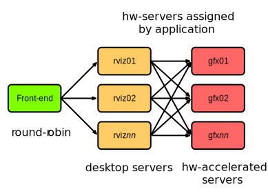

# The Alarik Desktop infrastructure

The desktop infrastructure deployed on Alarik consists of a front-end server with a Thinlinc server, 2 back-end nodes acting as desktop servers (Thinlinc agents). The Thinlinc server will assign users to one of the back-end servers depending on the current load of the back-end server. 

The back-end servers only support 2D graphics or emulated 3D graphics. To support applications requiring hardware accelerated graphics, 2 additional servers with NVIDIA Quadro 5000 cards provide this functionality.

Hardware graphics support is implemented using the VirtualGL protocol and is setup for specific applications provided throug a customised menu in desktop environment. Running such an application will connect to the backend graphics server using a special protocol, vglconnect, which will stream the accelerated application from the back-end server.

## Lessons learned

In general the implemented infrastructure have worked very well and have had no major issues. However, some lessons have been learnt during the use of this setup.

 * The desktop infrastructure can scale by adding server, but a session is assigned to a specific back-end server and shares the resources with other users on the same resource.
 * Resource limits are not easily enforced. It is possible for users with large visualisation needs to overallocate memory and the user experience of other users on the same node will suffer severely.
 * It is difficult to provide users with exclusive access to dedicated server for running graphical applications.
 * VirtualGL has to be configure on a per application basis and access to the graphics card is shared, reducing the performance depending on the number of users using the graphics card at the same time.
 * Supporting the desktop system is not the same as supporting an HPC resource. Tools for monitoring desktop sessions needs to be developed to provide a smooth user experience.
 * Existing authentication solutions must be taken into account when implementing a desktop infrastructure. The One Time Password system used at Lunarc needed to be adjusted to be able to used with Thinlinc to support the re-use of OTP-tokens.
 * There is a reliance on commercial software, such as Thinlinc, which can be a risk as well as an advantage. 