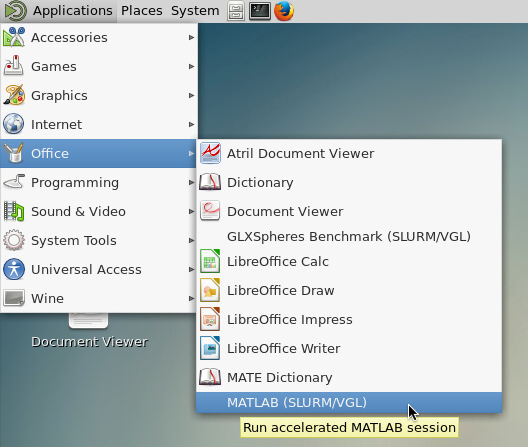
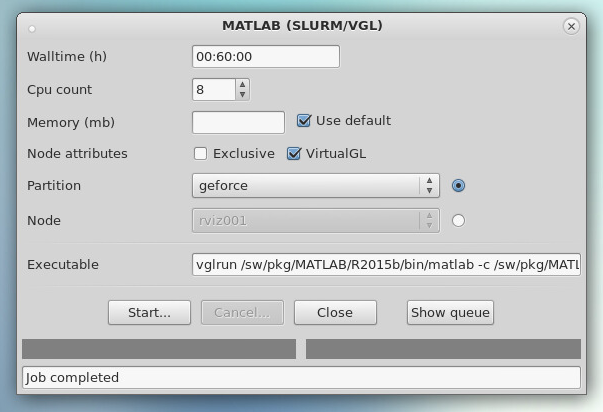
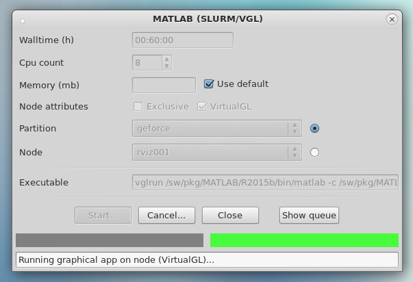
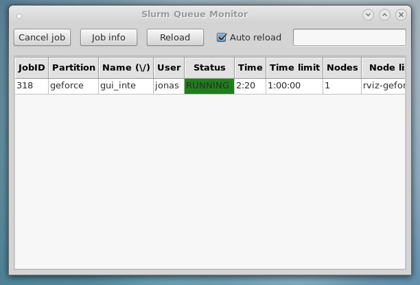
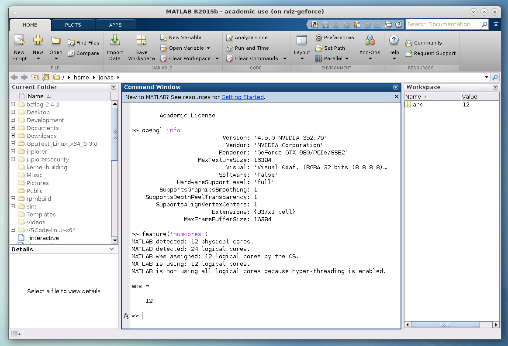

# Managing desktop resources through SLURM

One of the problem with the desktop configuration on Alarik is that the desktop servers are shared between many users which can lead to a bad user experience when memory is overallocated by some user. Performance of the graphics backend is also shared, reducing the available GPU performance available for graphics. To solve this issue we propose to take advantage of the SLURM resource manager, so that users can request time limited sessions with required memory and GPU resources. 

## Running interactive application through SLURM

SLURM has the ability to support interactive command line applications by the use of the **--pty** flag in conjunction with a bash-interpreter:
   
    $ srun --pty bash 

However this environment does not provide the ability to run graphical applications in a similar way as you can when using SSH. To fully support graphical applications either through SSH or using the **vglconnect** command, the nodes in the HPC resource must be able to allow SSH session to allocated nodes. This can be enabled using the **pam_slurm** PAM module. The problem with this approach is that most of the computational effort will be performed with processes started from the SSH-session and will _not_ be accounted and controlled through SLURM. To handle this we need to add any user ssh-sessions to the same cgroup as the current SLURM job. This can be done by using an additional PAM-module, **pam_exec** which will check the user and add the session the SLURM cgroup automatically at login.

The completed approach is as follows:

 1. Wrapper script submits a placeholder job to a special desktop partition.
 1. The script then waits for a succesful job submission.
 1. The graphical application is executed using either a **SSH -X** session (non-accelerated) or a **vglconnect** session.
 1. The PAM-module **pam_slurm** will check if user is allowed on the node.
 1. The PAM-module **pam_exec** with a custom script will add session to the running SLURM job.
 1. The script waits for successful termination.

## User interface for launching graphical applications through SLURM 

Ideally using SLURM for this should be as transparent for the user as possible. To achieve this, a special wrapper script have been developed that provides a configurable user interface for the user to select walltime, memory and gpu requirements. The script will be used in conjunction with a desktop shortcut. The following bash-script shows how MATLAB can be launched through SLURM using this approach.

    gfxlaunch --count 1 --vgl --partition geforce --cmd 'vglrun /sw/pkg/MATLAB/R2015b/bin/matlab -c /sw/pkg/MATLAB/R2015b/licenses/network.lic' --title 'MATLAB (SLURM/VGL)'
    
The script gfxlaunch can be configured using switches. The following list describes the main switches:

 * **--count [number of cpus]**
 
   The number of cpu:s (cores) to use for the application.
   
 * **--vgl** 
 
   Switch activating VirtualGL support when launching the application (vglconnect)
   
 * **--partition [name]**
 
   The partition to submit the job to.
   
 * **--cmd [cmd to execute]**
 
   The command to start the application. if --vgl is used the application must be started with **vglrun**
   
 * **--title [window title]
 
   Sets the title of the user interface displayed for the user.
   
## Example session running accelerated MATLAB

The idea behind the wrapper script user interface is to make it as easy as possible for users to run graphical applications through a resource management system. In following [figure](#menu-selection), a user selects a special menu item for MATLAB that calls the gfxlaunch script. 
   

The following user interface is shown after the menu item has been selected: 

In this dialog, the user can select walltime, number of cores, partition and the use of VirtualGL for the specific application. To start the application through SLURM, the users clicks on the **Start** button and the job is submitted to the queuing system. 

In the lower part of the window has 2 indicators showing the progress of the job in the resource management system. When there is no available resources the left indicator flashes yellow. When the job is running the second indicator becomes green. As shown in the next [figure](#running-job).

It is also possible to show all runnning jobs on the system by clicking on the **Show queue** button, as shown in the next [figure](#queue-monitor).

The following [figure](#running-matlab) shows an interactive MATLAB session running on a node in the cluster. In this case it is running on a node with a GeForce GTX 980 card with enabled acceleration.

