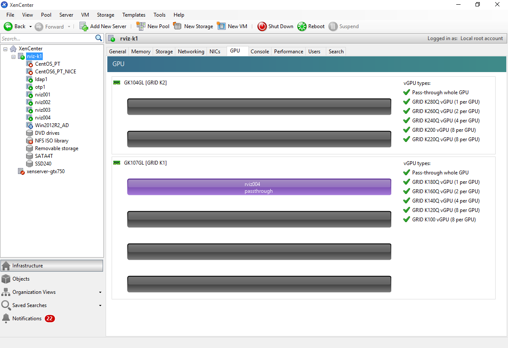
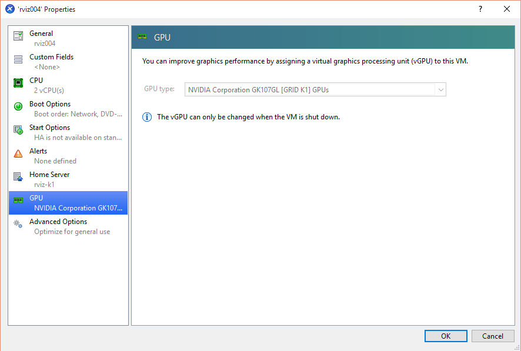
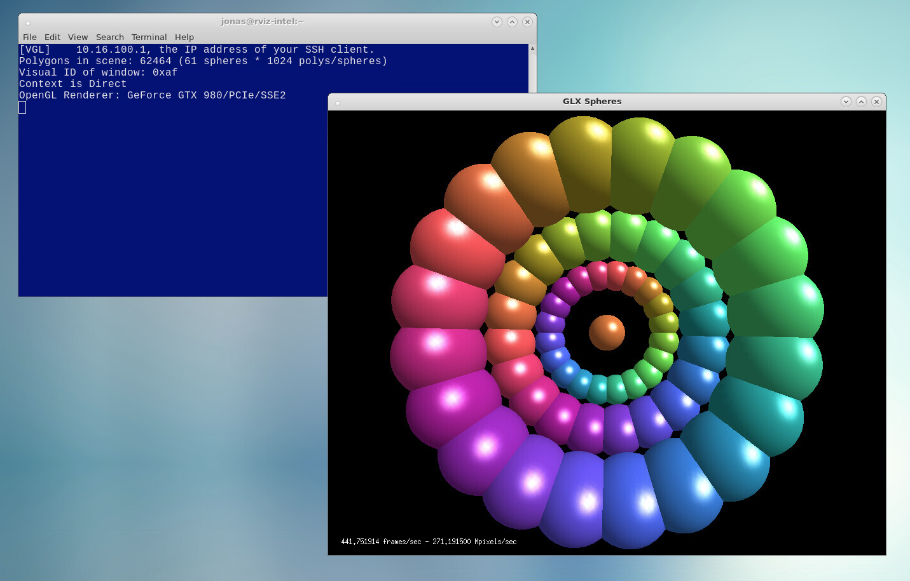

# Prototype Desktop Infrastructure

The high-level goals of a next generation desktop infrastructure:

 * Support allocation of desktop sessions through a resource management system such as SLURM.
 * Provide a scalable solution that can be extended based on user demands.
 * Create a easy to use system for users to allocate custom desktop sessions without using command line tools. 
 * Support additional OS environments such as Windows through a single unified desktop.
 

 
## Prototype setup

To be able to evaluate the different scenarios the prototype setup was implemented as a standard HPC cluster with commonly found services such as:

 * Resource manager (rviz-intel) - SLURM for job management
 * LDAP server (ldap1) - for user and group authentication
 * OTP server (otp1) - for two-factor authentication (PhenixID server)
 
The prototype also has 3 networks:
 
 * External network - available on rviz-intel.
 * Internal gigabit network - available on rviz-intel and all nodes.
 * Infiniband network - available on all rviz-intel and all nodes.
 * Admin network - for handling hardware interfaces.
  
## XenServer 6.5 Hypervisor

To be able to evaluate how hypervisors can be used to provide hardware accelerated graphics to virtual machines, the XenServer 6.5 Hypervisor was installed on the server with the NVIDIA GRID K1/K2 cards. The hypervisor was also used to provide additional services to the prototype such as LDAP and OTP services. 

XenServer 6.5 is able to provide GPU:s either as vGPU:s for Windows OS or using pass-trhough on Linux based distributions. To evaluate Linux support a virtual machine was created and assigned a NVIDIA K1 or K2 card. The machine was then installed with CentOS 7 as this is the OS that is most likely to be the target platform of upcoming SNIC resources.

## Supporting hardware acceleration on nodes with NVIDIA GPUs

To support hardware acceleration on nodes with pass-through GPUs or physical GPUs additional software and drivers are required, just like with a physical server with a graphics card. There are several issues to take care of before installing the actual driver. By default CentOS 7 uses a special open source driver, nouveau, to support the NVIDIA graphics cards without proprietary drivers. This driver interferes with the NVIDIA driver and must be black listed before the NVIDIA driver can be installed.

It is also important to make sure that the X11-server (xorg) is configured correctly and working before configuring additional services. For headless nodes or pure GPU:s this will require special options in the configuration of the X11-server to ignore non-existent or not-connected monitors.

## Supporting OpenGL in a remote desktop environment

OpenGL is most often used in a workstation setup where the graphics hardware will write directly to a visible framebuffer connected to a screen. In a remote desktop configuration hardware accelerated graphics must be redirected to a special frame buffer which is then displayed by the application and transferred over the network. 

In the prototype this reconfiguration is handled by the software layer VirtualGL. VirtualGL is an open source project that wraps the neccesary OpenGL calls and provides a virtual frame buffer for the graphics hardware to draw on. VirtualGL also integrates directly with many VNC servers, providing a seamless wrapping of OpenGL applications. 

VirtualGL can operate in 2 different modes. 

 1. Running an OpenGL application on a VNC server with an attached hardware accelerated GPU.
 1. Running an OpenGL application on a different server from the VNC server host. This server provides the hardware accelerated GPU. VirtualGL then transfers the OpenGL framebuffer back to the VNC server host where the rest of hte application is displayed.
 
Running an OpenGL application directly on the VNC server host, requires the use of the **vglrun** command as shown in the following example:

    $ vglrun /opt/VirtualGL/bin/glxspheres64
    
The **vglrun** command is responsible for wrapping the OpenGL calls and redirecting them to the graphics GPU. If this command is not used the OpenGL application will run using OpenGL software rendering, which can be very slow.

It is also possible to run the OpenGL application on a separate server using a remote VirtualGL session, which transfers the remote frame buffer to the client machine. The VirtualGL protocol only transfers the OpenGL framebuffer. Normal 2D user interface is handled through standard X11 forwarding using SSH.

The following screenshot show an example of a VirtualGL session to a remote server running the glxspheres64 example application at 442 FPS.

The performance of the OpenGL rendering in the VirtualGL session is only limited by the connection between the VNC-server and the remote graphics server. Bandwidth between these servers is relatively constant if running an application that does not lock the framerate. Running applications which only update display when the user is interacting with the OpenGL view will only transfer the frame buffer during the interactionm, reducing the network traffic. 
 
The perceived framerate on the client side is however entirely dependent on the network connection to the VNC-server. This can lead to erratic and lagging rendering even if the underlying OpenGL hardware displays with a high framerate. Even with a low bandwidth to the client, a user is still able to do high performance visusalisation as this is still performed on the backend GPU. 

## OpenGL Performance through VNC/VirtualGL

To evaluate the performance of the different hardware installed in the prototype the GpuTest (http://www.geeks3d.com/gputest/) benchmark was chosen as it can cover a range of advanced OpenGL rendering. The test were performed on a physical server equipeed with NVIDIA GTX 980 graphics cards as well as a virtual machines assigned a NVIDIA K1 and K2 GPU. To evaluate how the performance is affected by different window sizes, all benchmarks where run with 2 different window sizes, 1024x640 and 1920x1080. The results are shown in the following diagram:

It is clearly shown that the mix of hardware in the prototype can cover a wide range of visualisation needs from high-end, using the NVIDIA GTX980, to moderate, using NVIDIA K2 and low-end with NVIDIA K1. 

It is also shown that window size has a large impact on the framerate of the visualisation. This effect is not visible in the network traffic between the front-end and the back-end server. The bandwidth never reaches more the 30 MB/s running between these servers as shown in the following diagram:

It should also be noted that the GpuTest benchmarks provide an upper bound on advanced OpenGL rendering. Many standard scientific visualisation packages don't have these high demands on the graphics hardware and will probarbly achieve higher framerates. They often only render during user interaction. For scientific visualisation a low framerate can be tolerable compared to real-time rendering. Often the constraints when running visualisation application is not the graphics card but availble memory in the server for holding the data to be visualised.

Using virtual machines with pass-through GPUs can also achieve very good performance equal to that of desktop equivalents as shown in the K1/K2 results (running on a single core virtual machine).