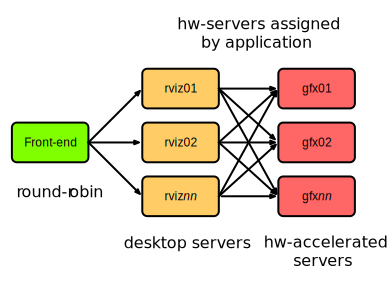
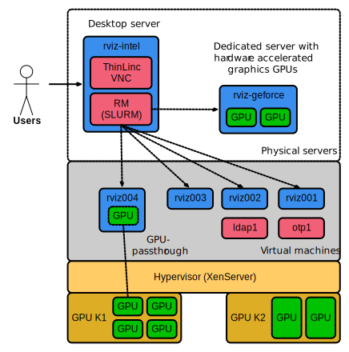
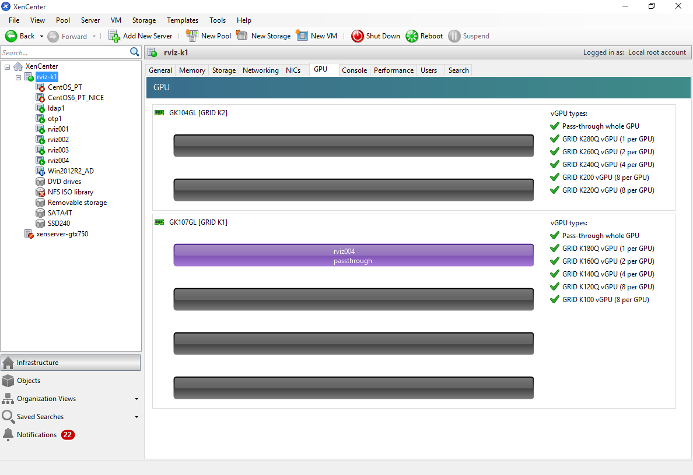
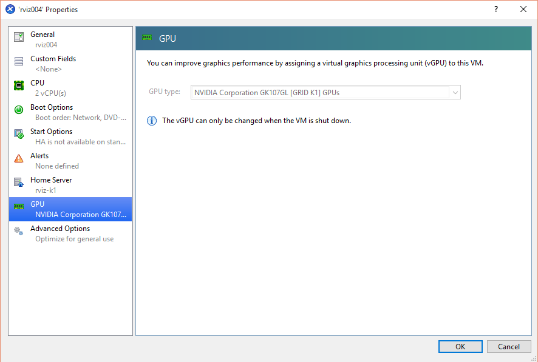
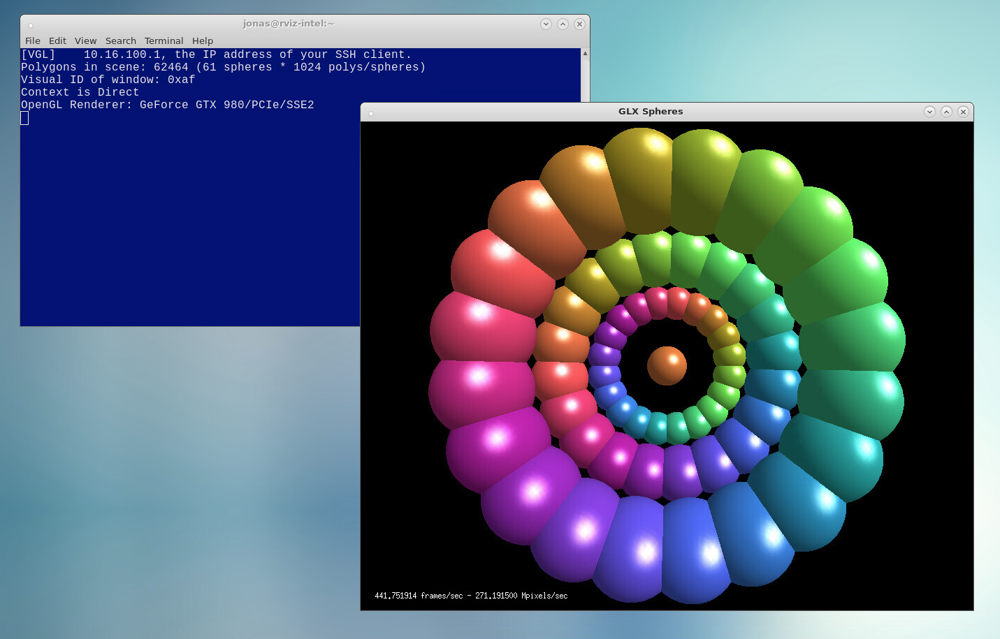
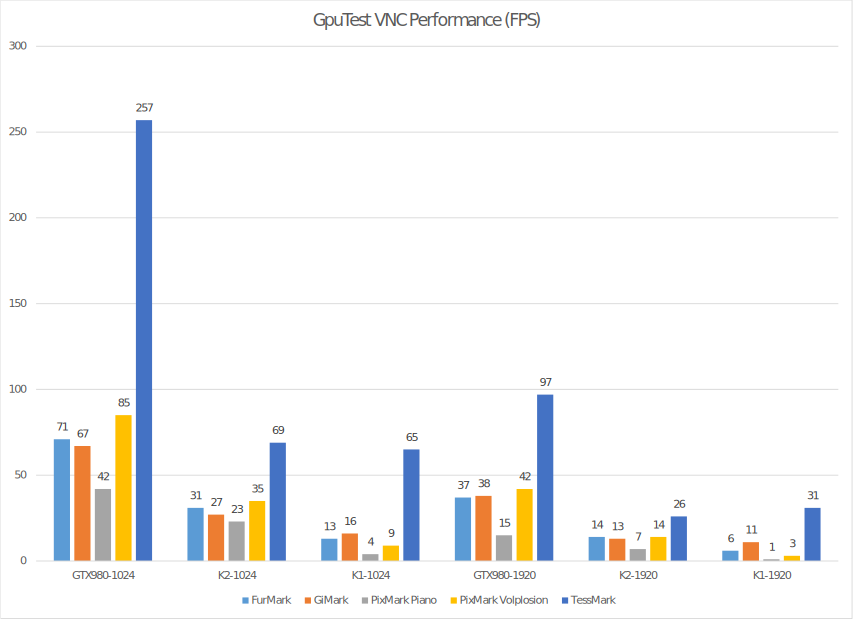
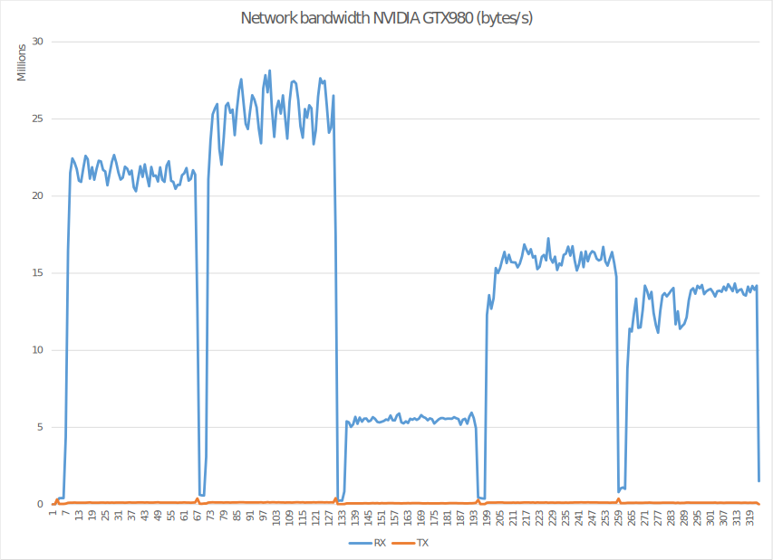

% A next generation desktop infrastructure for HPC
% Jonas Lindemann;Anders Follin
% 2016-01-26

# Introduction

During the 2013-2015 Lunarc has been operating a desktop infrastructure on the Alarik resource, to evaluate if this could complement the existing terminal-based environment. This environment have been continously been in production since mid 2013 and been a great success among the users. We currently have approximately between 30-50 active users in this environment.

A prototype system was procured to test and develop ideas for a more rich and scalable SNIC desktop architecture. The prototype was installed in the beginning of 2015 and will be the blueprint for the upcoming Aurora desktop infrastructure.

# The Alarik Desktop infrastructure

The desktop infrastructure deployed on Alarik consists of a front-end server with a Thinlinc server, 2 back-end nodes acting as desktop servers (Thinlinc agents). The Thinlinc server will assign users to one of the back-end servers depending on the current load of the back-end server. 

The back-end servers only support 2D graphics or emulated 3D graphics. To support applications requiring hardware accelerated graphics, 2 additional servers with NVIDIA Quadro 5000 cards provide this functionality.

Hardware graphics support is implemented using the VirtualGL protocol and is setup for specific applications provided throug a customised menu in desktop environment. Running such an application will connect to the backend graphics server using a special protocol, vglconnect, which will stream the accelerated application from the back-end server.

## Lessons learned

In general the implemented infrastructure have worked very well and have had no major issues. However, some lessons have been learnt during the use of this setup.

 * The desktop infrastructure can scale by adding server, but a session is assigned to a specific back-end server and shares the resources with other users on the same resource.
 * Resource limits are not easily enforced. It is possible for users with large visualisation needs to overallocate memory and the user experience of other users on the same node will suffer severely.
 * It is difficult to provide users with exclusive access to dedicated server for running graphical applications.
 * VirtualGL has to be configure on a per application basis and access to the graphics card is shared, reducing the performance depending on the number of users using the graphics card at the same time.
 * Supporting the desktop system is not the same as supporting an HPC resource. Tools for monitoring desktop sessions needs to be developed to provide a smooth user experience.
 * Existing authentication solutions must be taken into account when implementing a desktop infrastructure. The One Time Password system used at Lunarc needed to be adjusted to be able to used with Thinlinc to support the re-use of OTP-tokens.
 * There is a reliance on commercial software, such as Thinlinc, which can be a risk as well as an advantage. 

# The SNIC ET Prototype system

To be able to try different desktop solutions and configurations a prototype system was procured during end of 2014. The procured hardware was chosen in a way that we could evaluate many of the availble solutions as possible. 

The final hardware consisted of:

 * XenServer with NVIDIA Grid K1/K2 cards 
   * 48 GB Memory
   * 2 x 2620v3 Xeon Processors at 2.4 GHz
   * 1 x NVIDIA Grid K1 card
   * 1 x NVIDIA Grid K2 card
   * Storage array with 6 x 1 TB 2.5 inch drives
 * Server with consumer grade NVIDIA cards
   * 64 GB Memory
   * 2 x 2620v3 Xeon Processors at 2.4 GHz
   * 2 x NVIDIA Grid GTX 980
 * Server with Xeon processor with built-in graphics
   * 32 GB Memory
   * 1 x Xeon E3-1268L
 * Infiniband switch
 * Gigabit switch
 
## Virtual environment for sharing GPU:s
 
An interesting development is the ability for virtual environments to provide access to hardware based graphics acceleration to GPU-nodes. Sharing can be done using 2 methods. In the first method, a part of a GPU is shared with a virtual machine. This is often called virtual GPU or vGPU. Similar to the concept of virtual CPU or vCPU in standard virtual environments. The method is currently not well supported for Linux based virtual machines. In the second method, an entire GPU is shared with a virtual machine. The address space of the GPU is passed-through to the virtual machine. The method is often called pass-through GPU.

For Windows based virtual machines the vGPU concept works well and the RemoteFX protocol and client can be used to access the accelerated desktop. Performance is good and the limiting factor here is the network-bandwidth to the client application. The problem with this approach is to find a way of integrating Windows support in a SNIC desktop infrastructure. This issue is covered more in the following sections.

Passing through GPU:s to Linux based virtual machines works well using XenServer as long as a generic Linux is selected when creating the virtual machine. If a supported Linux distribution is selected pass-through is disabled. To be able to take advantage of the GPU the NVIDIA driver has to be installed on the virtual machine and configured for desktop use. As the pass-through GPU does not provide a display in a normal sense. Access to acceleration must be provided through VirtualGL or similar methods of capturing the image stream from the GPU. We have succesfully tested CentOS 7 based virtual machines with pass-through GPU.

Using the installed K1/K2 cards from NVIDIA the prototype can provide 6 (4+2) pass-through GPU:s to Linux based virtual machines. For moderate needs the K2 card can be replaced with a K1 card and the soluion can provide 8 Linux based virtual machines with accelerated graphics. If vGPU gets better Linux support a single XenServer can provide up to 32 virtual machines with accelerated graphics.

## Xeon processors with built-in graphics

Another interesting development is the introduction of built-in graphics in Xeon server processors. Previously Intel support for built-in graphics was limited to desktop machines and laptops, making it difficult to provide a solution that can be used in a data center or HPC context. 

Intel now have several Xeon server processors with built-in graphics with the Xeon E3-1200 family. One of the servers in the prototype uses a E3-1268L processor with built-in graphics. These processors are often provided in a small formfactors, enabling high-density solutions with supporting accelerated graphics. 

The graphics performance of these processors are limited to low-end graphics acceleration, but could be a solution for moderate graphics need. 

## Consumer grade graphics solution

For enterprise and high-end graphics, NVIDIA provides the Quadro series of graphics cards. These are expensive cards often tailored for enterprise applications. An idea we discussed in this project, was to evaluate the use of consumer grade graphics cards such as the NVIDIA GTX 980 to provide high-end graphics performance to a lower cost. A machine with 2 GTX 980 cards where installed in a standard rack-mountable workstation. The performance is very good and they can provide an alternative to the Quadro cards. However, the problem with the consumer cards is that they are designed to be actively cooled with a built-in fan, limiting its use in high-density deployment.  

# Remote desktop solutions

Unix and Linux have since many years been able to provide remote desktop services using the X11 protocol. However, the X11 protocol requires the user to install a X11 server on the client system, which can be very complicated and not well supported on all platforms. Also, the protocol itself is not inherintly secure and to use it securely it has to be tunneled or used through a VPN, increasing the complexity of using this solution. 

A a more platform independent solution is Virtual Network Computer or VNC. This technology uses the Remote Frame Buffer protocol or RFB. The technology relays mouse and keyboard event to a remote computer and transfers updated portions of the frame buffer over the network. VNC is open source and has spawned several projects providing different implementations of the protocol. By default the VNC implementation uses a unsecure authentication mechanism, but many of the VNC projects add an additional security layer either by tunneling through SSH or implementing its own security layer.

There also exists several proprietary solutions as well implementing their own protocols and authentication. In this project we have evaluated some of these protocols to see what benefits and limitations they provide.  
## Thinlinc

ThinLinc is a VNC implementation from a Swedish company, Cendio. The ThinLinc solution include both a native client for Mac OS X, Linux and Windows and server side components. 

The server side part of ThinLinc can be used to implement a single server solution as well as scalable solution over several servers (agents). The main server load balances desktop sessions over all agents depending on the current load of the agent server.

One of the biggest benefits of using ThinLinc is their support of native, easy to use, clients for all major platforms. With a simple one-click installer the client can be installed on all major platforms.

## Nice DCV

Desktop Cloud Visualisation, DCV, from NICE is a proprietary solution and protocol for providing remote desktop services. DCV supports hardware acceleration using NVIDIA GRID technologies as well as fully supporting hardware acceleration under Windows as well as Linux. 

The server side is built on VNC with custom additions for supporting hardware accelerated graphics. The DCV server can also operate in different modes. 

 * Pass-through mode supporting a single VM with a passthrough GPU
 * XenServer 6.x support vGPUs
 * Standalone server with GPU.
 
The benefits of NICE DCV is the support of multiple OS application servers, enabling users to run hardware accelerated Windows and Linux applications. When evaluating DCV, it was not clear how it's security framework can integrate in a HPC Linux environment. Does it support PAM-modules and integration of external authentication protcols? Pricing of the product is also quite high compared to the Thinlinc solution.

The NICE DCV solution was evaluated on XenServer 6.5 using the NVIDIA K1 and K2 cards. Installation was easy and it supported vGPU sharing under Windows.

## Microsoft Remote Desktop / RemoteFX

Microsoft have had remote desktop services built-in to the professional and enterprise offerings for a long time, with their Remote Desktop Protocol or RDP. Recently they support hardware accelererated graphics through RDP using a technology called RemoteFX. 

The RDP protocol in its non-accelerated form is supported from a Linux client using the rdesktop application. The RemoteFX protocol is however not yet supported. Using RDP, 2D Windows applications can be provided to a Linux based desktop environment using the rdesktop tool.

The RemoteFX protocol has been evaluated on the XenServer 6.5 using the NVIDIA K1 an K2 cards and works vGPUs with a special NVIDIA driver. Performance is good enough to run high-end visualisation software and games.

## XenApp / XenDesktop

The RDP protocol was originally developed by Citrix for Microsoft as their remote desktop product Terminal Server. Citrix has continued their development of RDP and this protocol is what is used in their remote desktop/application solutions XenDesktop and XenApp. 

XenDesktop provides a desktop environment and XenApp is a special derivative of the XenDesktop that only provide remote access to specific graphical applications without the desktop.

The XenDesktop and XenApp solutions can both work with hardware accelerated graphics natively or through vGPU on a hypervisor. Currently the major platform is Windows, but there is work on providing support for Linux based application and dekstop virtualisation.

It was decided not to evaluate this solution as its support for Linux is not yet developed. 

# Prototype Desktop Infrastructure

The high-level goals of a next generation desktop infrastructure:

 * Support allocation of desktop sessions through a resource management system such as SLURM.
 * Provide a scalable solution that can be extended based on user demands.
 * Create a easy to use system for users to allocate custom desktop sessions without using command line tools. 
 * Support additional OS environments such as Windows through a single unified desktop.
 

 
## Prototype setup

To be able to evaluate the different scenarios the prototype setup was implemented as a standard HPC cluster with commonly found services such as:

 * Resource manager (rviz-intel) - SLURM for job management
 * LDAP server (ldap1) - for user and group authentication
 * OTP server (otp1) - for two-factor authentication (PhenixID server)
 
The prototype also has 3 networks:
 
 * External network - available on rviz-intel.
 * Internal gigabit network - available on rviz-intel and all nodes.
 * Infiniband network - available on all rviz-intel and all nodes.
 * Admin network - for handling hardware interfaces.
  
## XenServer 6.5 Hypervisor

To be able to evaluate how hypervisors can be used to provide hardware accelerated graphics to virtual machines, the XenServer 6.5 Hypervisor was installed on the server with the NVIDIA GRID K1/K2 cards. The hypervisor was also used to provide additional services to the prototype such as LDAP and OTP services. 

XenServer 6.5 is able to provide GPU:s either as vGPU:s for Windows OS or using pass-trhough on Linux based distributions. To evaluate Linux support a virtual machine was created and assigned a NVIDIA K1 or K2 card. The machine was then installed with CentOS 7 as this is the OS that is most likely to be the target platform of upcoming SNIC resources.

## Supporting hardware acceleration on nodes with NVIDIA GPUs

To support hardware acceleration on nodes with pass-through GPUs or physical GPUs additional software and drivers are required, just like with a physical server with a graphics card. There are several issues to take care of before installing the actual driver. By default CentOS 7 uses a special open source driver, nouveau, to support the NVIDIA graphics cards without proprietary drivers. This driver interferes with the NVIDIA driver and must be black listed before the NVIDIA driver can be installed.

It is also important to make sure that the X11-server (xorg) is configured correctly and working before configuring additional services. For headless nodes or pure GPU:s this will require special options in the configuration of the X11-server to ignore non-existent or not-connected monitors.

## Supporting OpenGL in a remote desktop environment

OpenGL is most often used in a workstation setup where the graphics hardware will write directly to a visible framebuffer connected to a screen. In a remote desktop configuration hardware accelerated graphics must be redirected to a special frame buffer which is then displayed by the application and transferred over the network. 

In the prototype this reconfiguration is handled by the software layer VirtualGL. VirtualGL is an open source project that wraps the neccesary OpenGL calls and provides a virtual frame buffer for the graphics hardware to draw on. VirtualGL also integrates directly with many VNC servers, providing a seamless wrapping of OpenGL applications. 

VirtualGL can operate in 2 different modes. 

 1. Running an OpenGL application on a VNC server with an attached hardware accelerated GPU.
 1. Running an OpenGL application on a different server from the VNC server host. This server provides the hardware accelerated GPU. VirtualGL then transfers the OpenGL framebuffer back to the VNC server host where the rest of hte application is displayed.
 
Running an OpenGL application directly on the VNC server host, requires the use of the **vglrun** command as shown in the following example:

    $ vglrun /opt/VirtualGL/bin/glxspheres64
    
The **vglrun** command is responsible for wrapping the OpenGL calls and redirecting them to the graphics GPU. If this command is not used the OpenGL application will run using OpenGL software rendering, which can be very slow.

Running an OpenGL application on a separate server with a graphics GPU requires the use of the **vglconnect** command. This command is a specialised ssh-client which sets up the extra channel required for transferring the frame buffer from the remote graphics server. 2D user interface is handled through standard X11 forwarding through SSH. A typical **vglconnect** command is shown below:

    $ vglconnect rviz-geforce vglrun /opt/VirtualGL/bin/glxspheres64

    VirtualGL Client 64-bit v2.4 (Build 20150126)
    Listening for unencrypted connections on port 4242
    Redirecting output to /home/jonas/.vgl/vglconnect-rviz-intel-:1.0.log

    [VGL] NOTICE: Automatically setting VGL_CLIENT environment variable to
    [VGL]    10.16.100.1, the IP address of your SSH client.
    Polygons in scene: 62464 (61 spheres * 1024 polys/spheres)
    Visual ID of window: 0xaf
    Context is Direct
    OpenGL Renderer: GeForce GTX 980/PCIe/SSE2

The following screenshot show an example of a vglconnect session to a remote server running the glxspheres64 example application at 442 FPS.

The performance of the OpenGL rendering in the vglconnect session is only limited by the connection between the VNC-server and the remote graphics server. Bandwidth between these servers is relatively constant if running an application that does not lock the framerate. Running applications which only update display when the user is interacting with the OpenGL view will only transfer the frame buffer during the interactionm, reducing the network traffic. 
 
The perceived framerate on the client side is however entirely dependent on the network connection to the VNC-server. This can lead to erratic and lagging rendering even if the underlying OpenGL hardware displays with a high framerate. Even with a low bandwidth to the client, a user is still able to do high performance visusalisation as this is still performed on the backend GPU. 

## OpenGL Performance through VNC/VirtualGL

To evaluate the performance of the different hardware installed in the prototype the GpuTest (http://www.geeks3d.com/gputest/) benchmark was chosen as it can cover a range of advanced OpenGL rendering. The test were performed on a physical server equipeed with NVIDIA GTX 980 graphics cards as well as a virtual machines assigned a NVIDIA K1 and K2 GPU. To evaluate how the performance is affected by different window sizes, all benchmarks where run with 2 different window sizes, 1024x640 and 1920x1080. The results are shown in the following diagram:

It is clearly shown that the mix of hardware in the prototype can cover a wide range of visualisation needs from high-end, using the NVIDIA GTX980, to moderate, using NVIDIA K2 and low-end with NVIDIA K1. 

It is also shown that window size has a large impact on the framerate of the visualisation. This effect is not visible in the network traffic between the front-end and the back-end server. The bandwidth never reaches more the 30 MB/s running between these servers as shown in the following diagram:

It should also be noted that the GpuTest benchmarks provide an upper bound on advanced OpenGL rendering. Many standard scientific visualisation packages don't have these high demands on the graphics hardware and will probarbly achieve higher framerates. They often only render during user interaction. For scientific visualisation a low framerate can be tolerable compared to real-time rendering. Often the constraints when running visualisation application is not the graphics card but availble memory in the server for holding the data to be visualised.

Using virtual machines with pass-through GPUs can also achieve very good performance equal to that of desktop equivalents as shown in the K1/K2 results (running on a single core virtual machine).

# Managing desktop resources through SLURM

One of the problem with the desktop configuration on Alarik is that the desktop servers are shared between many users which can lead to a bad user experience when memory is overallocated by some user. Performance of the graphics backend is also shared, reducing the available GPU performance available for graphics. To solve this issue we propose to take advantage of the SLURM resource manager, so that users can request time limited sessions with required memory and GPU resources. 

Ideally using SLURM for this should be as transparent for the user as possible. We have developed a special wrapper script that provides a simple user interface for the user to select walltime, memory and gpu requirements. The script will be used in conjunction with a desktop shortcut. 

BILD PÅ GRÄNSNITT

## Running interactive application through SLURM

SLURM has the ability to support interactive command line applications by the use of the **--pty** flag in conjunction with a bash-interpreter:
   
    $ srun --pty bash 

However this environment does not provide the ability to run graphical applications in a similar way as you can when using SSH. To fully support graphical applications either through SSH or using the **vglconnect** command, the nodes in the HPC resource must be able to allow SSH session to allocated nodes. This can be enabled using the **pam_slurm** PAM module. The problem with this approach is that most of the computational effort will be performed with processes started from the SSH-session and will _not_ be accounted and controlled through SLURM. To handle this we need to add any user ssh-sessions to the same cgroup as the current SLURM job. This can be done by using an additional PAM-module, **pam_exec** which will check the user and add the session the SLURM cgroup automatically at login.

The completed approach is as follows:

 1. Wrapper script submits a placeholder job to a special desktop partition.
 1. The script then waits for a succesful job submission.
 1. The graphical application is executed using either a **SSH -X** session (non-accelerated) or a **vglconnect** session.
 1. The PAM-module pam_slurm will check if user is allowed on the node.
 1. The PAM-module pam_exec with a custom script will add session to the running SLURM job.
 1. The script waits for successful termination.

